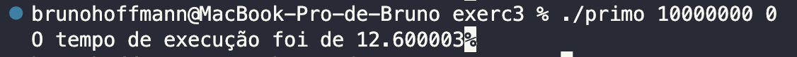
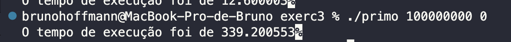
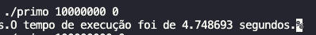
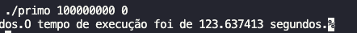

Nome: Bruno da Siqueira Hoffmann

Disciplina: Análise e Aplicação de Sistemas Operacionais

Link do GitHub: https://github.com/BrunoHoffmann15/sistemas-operacionais-praticas/tree/main/aula-5

# Atividade 5

## Exercício 1

Para esse exercício foi utilizado o recurso de pipe para fazer o compartilhamento entre os diferentes processos, um dos processos será responsável por gerar um arquivo com o conteúdo do curl, ler esse arquivo e enviar os dados para o pipe. O segundo processo vai utilizar o dup para colocar esse dado na saída, e em seguida executará o commando através da chamada system. Abaixo segue o código desenvolvido:

```c
#include <stdio.h>
#include <stdlib.h>
#include <string.h>
#include <stdlib.h>
#include <fcntl.h>
#include <stdio.h>
#include <sys/stat.h>
#include <unistd.h>
#include <fcntl.h>

#define CURL "curl "
#define OUTPUT " -o "
#define DESTINATION "temp_file"
#define PIPE " | "
#define EGREP "grep -oi "
#define QUOTATION "'"
#define WC "wc -l"
#define ECHOMIN 512
#define ECHOMAX 1048576

void get_page(char *val, int file_descriptor[2]);
void find_occurences(char *match_data);
char *get_data_from_file(char returned_value[ECHOMAX]);
void execute_command(char *command);

int main(int argc, char *argv[])
{
  char data[ECHOMAX];
  int file_pipes[2];
  pid_t fork_result;

  if (argc < 3)
  {
    printf("Digite o valor <url> e <palavra>. (ex: ./exercicio1 https://g1.globo.com coronavirus) \n");
    exit(EXIT_FAILURE);
  }

  if (pipe(file_pipes) == 0)
  {
    fork_result = fork();

    if (fork_result == 0)
    {
      close(0);
      close(file_pipes[1]);
      dup(file_pipes[0]);
      find_occurences(argv[2]);
      close(file_pipes[0]);
    }
    else
    {
      close(file_pipes[0]);
      get_page(argv[1], file_pipes);
      close(file_pipes[1]);
    }
  }

  exit(EXIT_SUCCESS);
}

void get_page(char *val, int file_descriptor[2])
{
  char command[ECHOMIN];
  char returned_value[ECHOMAX];

  strcpy(command, CURL);
  strcat(command, val);
  strcat(command, OUTPUT);
  strcat(command, DESTINATION);

  system(command);

  get_data_from_file(returned_value);

  write(file_descriptor[1], returned_value, strlen(returned_value));
}

char *get_data_from_file(char returned_value[ECHOMAX])
{
  FILE *fp;
  char buffer[ECHOMAX];

  fp = fopen(DESTINATION, "r");

  int i = 0;
  while (1)
  {
    buffer[i] = fgetc(fp);
    if (buffer[i] == EOF)
      break;
    ++i;
  }

  pclose(fp);

  strcpy(returned_value, buffer);

  return returned_value;
}

void find_occurences(char *match_data)
{
  char command[ECHOMAX];

  strcat(command, EGREP);
  strcat(command, QUOTATION);
  strcat(command, match_data);
  strcat(command, QUOTATION);
  strcat(command, PIPE);
  strcat(command, WC);
  system(command);
}
```

## Exercício 2

Para esse exercício foi utilizado o recurso do pipe para fazer o compartilhamento das matrizes entre os processos. Além disso, o código de impressão da matriz e de multiplicação foram baseadas na implementações do site **Geek for Geeks**. Abaixo segue o código desenvolvido:

```c
#include <stdio.h>
#include <stdlib.h>
#include <unistd.h>
#include <fcntl.h>

#define ROW_SIZE 4
#define COLUMN_SIZE 4

void generateMatrix();
void printMatrix(int matrix[ROW_SIZE][COLUMN_SIZE]);
void mulMat(int mat1[][COLUMN_SIZE], int mat2[][COLUMN_SIZE]);

int main()
{
  int matrix[ROW_SIZE][COLUMN_SIZE];
  int matrix2[ROW_SIZE][COLUMN_SIZE];
  int data;
  int file_pipes[2];
  const char some_data[] = "123";
  pid_t fork_result;

  if (pipe(file_pipes) != 0) {
    printf("Ocorreu um erro.");
    exit(EXIT_FAILURE);
  }

  fork_result = fork();
  generateMatrix(&matrix);
  printMatrix(matrix);

  if (fork_result == 0) {
    close(file_pipes[1]);
    printf("Matriz recebida pelo processo %d.\n", getpid());
    read(file_pipes[0], &matrix2, sizeof(matrix2));
    mulMat(matrix, matrix2);
    close(file_pipes[1]);
  } else {
    close(file_pipes[0]);
    write(file_pipes[1], matrix, sizeof(matrix));
    printf("Matriz enviada pelo processo %d.\n", getpid());
    close(file_pipes[1]);
  }

  exit(EXIT_SUCCESS);
}

void generateMatrix(int matrix[ROW_SIZE][COLUMN_SIZE])
{
  for (int i = 0; i < ROW_SIZE; i++)
  {
    for (int j = 0; j < COLUMN_SIZE; j++)
    {
      matrix[i][j] = (arc4random() % 10); // to run in Mac.
      // matrix[i][j] = (rand() % 10); // to run in Linux.
    }
  }
}

// Obtido pelo site Geek for Geeks - https://www.geeksforgeeks.org/c-program-multiply-two-matrices/
void mulMat(int mat1[][COLUMN_SIZE], int mat2[][COLUMN_SIZE])
{
  int rslt[ROW_SIZE][COLUMN_SIZE];
  printf("Resultado da multiplicação da matriz feita pelo processo %d:\n", getpid());
  printf("---------------------------\n");

  for (int i = 0; i < ROW_SIZE; i++)
  {
    for (int j = 0; j < COLUMN_SIZE; j++)
    {
      rslt[i][j] = 0;

      for (int k = 0; k < ROW_SIZE; k++)
      {
        rslt[i][j] += mat1[i][k] * mat2[k][j];
      }

      printf("%d\t", rslt[i][j]);
    }
    printf("\n");
  }
  printf("----------------------------\n");
}

// Obtido no site geek for geeks: https://www.geeksforgeeks.org/c-program-multiply-two-matrices/
void printMatrix(int matrix[ROW_SIZE][COLUMN_SIZE]) {
  printf("Matrix gerada pelo processo %d:\n", getpid());
  printf("---------------------------\n");
  for (int i = 0; i < ROW_SIZE; i++)
  {
    for (int j = 0; j < COLUMN_SIZE; j++)
      printf("%d\t", matrix[i][j]);
    printf("\n");
  }
  printf("---------------------------\n");
}
```


## Exercício 3

Ao executar o exercício no primeiro caso foi identificado o tempo de **12** segundos para 10.000.000 registros, e **339** segundos para 100.000.000 registros.

**Anexo 1**: Executando 10.000.000 registro de forma não concorrente:



**Anexo 2**: Executando 100.000.000 registro de forma não concorrente:



**Anexo 3**: Executando 10.000.000 registro de forma concorrente:



**Anexo 4**: Executando 100.000.000 registro de forma concorrente:



Agora executando com concorrência, o tempo para 10.000.000 foi de **4** segundos e para 100.000.000 foi de **123** segundos. Abaixo segue o código desenvolvido:


```c
/* primos.c – identifica todos os numeros primos ate um certo valor*/
// complile com -lm. Por exemplo: “gcc primo.c -o primo -lm”

#include <time.h>
#include <stdio.h>
#include <math.h>
#include <stdlib.h>
#include <unistd.h>
#include <sys/wait.h>

int verifica_se_primo(long int);
int verificar_parte(int inicio, int fim, int imprimir);
void executar_sem_concorrencia(int inicio, int fim, int imprimir);
void executar_com_concorrencia(int numero, int imprimir);

int main(int argc, char *argv[])
{
  long int numero = 0;
  short int imprimir, concorrencia;

  if (argc != 4)
  {
    printf("Uso correto: %s <numero> <imprimir=1,nao_imprimir=0> <concorrencia=1,sem_concorrencia=0>\n\n", argv[0]);
    return 1;
  }

  numero = atol(argv[1]);
  imprimir = atoi(argv[2]);
  concorrencia = atoi(argv[3]);

  if (concorrencia) {
    executar_com_concorrencia(numero, imprimir);
  } else {
    executar_sem_concorrencia(0, numero, imprimir);
  }

  return 0;
}

void executar_sem_concorrencia(int inicio, int fim, int imprimir)
{
  clock_t start, end;

  start = clock();
  
  verificar_parte(inicio, fim, imprimir);

  end = clock();

  double time_spent = (double)(end - start) / CLOCKS_PER_SEC;
  printf("O tempo de execução foi de %f segundos.", time_spent);
}

void executar_com_concorrencia(int numero, int imprimir)
{
  int inicio, fim, status;
  pid_t child_pid;
  child_pid = fork();

  if (child_pid == 0)
  {
    inicio = 0;
    fim = numero / 2;

    verificar_parte(inicio, fim, imprimir);
  }
  else 
  {
    clock_t start, end;
    inicio = numero / 2;
    fim = numero;

    start = clock();
    verificar_parte(inicio, fim, imprimir);
    waitpid(child_pid, &status, 0);
    end = clock();

    double time_spent = (double)(end - start) / CLOCKS_PER_SEC;
    printf("O tempo de execução foi de %f segundos.", time_spent);
  }
}

int verificar_parte(int inicio, int fim, int imprimir)
{
  short int result;

  for (int num_int = inicio; num_int < fim; num_int++)
  {
    result = verifica_se_primo(num_int);
    if (imprimir == 1)
      if (result == 1)
        printf("%d eh primo.\n", num_int);
  }
}

int verifica_se_primo(long int numero)
{
  long int ant;
  for (ant = 2; ant <= (long int)sqrt(numero); ant++)
  {
    if (numero % ant == 0)
      return 0;
  }
  if (ant * ant >= numero)
    return 1;
}
```